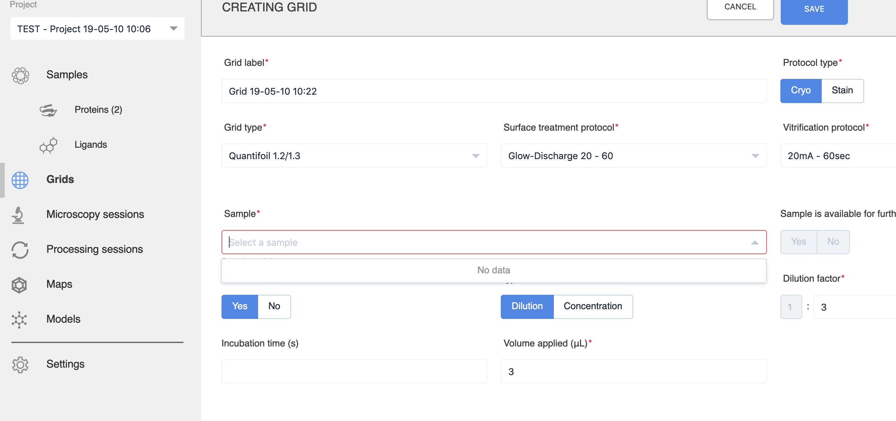

# gP2S F.A.Q.s - Frequently Asked Questions

## Usage

#### I created proteins, but no sample is showing up when I try to create a grid

You have created 2 proteins, but no sample yet.

A sample is a mixture of proteins and ligands (can be 0 proteins or 0 ligands, but must be at least one component). Once you have created a sample, it will show up in the drop down during grid creation.

If you want to save time, you can create a sample directly because that form let's you create the proteins on the fly.

The reason it is organized this way is that you can have one protein prep re-used between different samples (for example, each with their own ligand).

#### Are all web browsers supported?

gP2S has been tested with Chrome and Safari. We have had reports of problems with some versions of Firefox (66.0.3 (64-bit)). 

## Administration

#### How do I add new users?

gP2S does not manage user accounts. Instead it relies on an LDAP server to authenticate users. If you are using the dockerized gP2S, it comes with its own LDAP server built-in. You have two options:

1. You can run your own LDAP server (for example, the one that comes with dockerized gP2S) to manage user accounts. 
2. You can get gP2S to query an existing LDAP server, for example the one from your institution, so that users would just use their "normal" user name and password to login to gP2S and you wouldn't be responsible for maintaining that part.

If you choose option (1), see the section "How to add a user to dockerized LDAP". If you choose option (2), see the section "How to connect gP2S application to your own databases or LDAP server" and the following section "Configuration", in particular the LDAP_* variables.

#### Does this give separate project spaces for different 'labs' (as in, different labs on campus not wanting to share information)? Or does everyone share the same project space?

Within an instance of gP2S, everything is open to all authenticated users, but it should be easy to run separate instances each with their own authentication. But the real solution might be to improve the culture on your campus!
